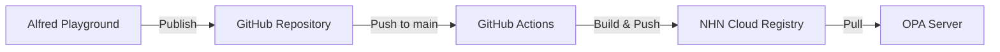

# Policy Registry 구조

정책을 GitHub에 저장하고 NHN Cloud Registry에 배포하는 구조입니다.

## 디렉토리 구조

```
policy_registry/
├── .github/
│   └── workflows/
│       └── ncr-policy-deploy.yml    # NCR 배포 파이프라인
├── policies/                        # 모든 OPA 정책 저장
│   ├── {policy_id}/                # Alfred에서 publish한 정책
│   │   ├── policy.rego             # Rego 정책 파일
│   │   ├── data.json              # 관련 데이터
│   │   ├── inputs.json            # 테스트 입력값
│   │   ├── metadata.json          # 정책 메타데이터
│   │   └── README.md              # 정책 설명
│   └── ...
└── README.md
```

## 파이프라인 플로우



## 워크플로우 설명

### 1. 트리거
- `main` 브랜치에 push
- `policies/` 디렉토리 변경 시
- 수동 실행 가능

### 2. 빌드 프로세스
1. **Policy CLI 설치**
   - opcr-io/tap/policy CLI 도구 설치

2. **NCR 로그인**
   ```bash
   policy login -s <NCR_REGISTRY> -u <ACCESS_KEY> -p <SECRET_KEY>
   ```

3. **정책 번들 빌드**
   ```bash
   policy build policies -t <registry>/<org>/<repo>:<tag>
   ```

4. **NCR에 푸시**
   ```bash
   policy push <registry>/<org>/<repo>:<tag>
   ```

### 3. 태그 전략
- `latest`: 항상 최신 버전
- `{commit_sha}`: 특정 커밋 버전
- 수동 실행 시 custom tag 가능

## 배포된 정책 사용

### OPA 서버에서 정책 사용

1. **정책 Pull**
```bash
policy pull <NCR_REGISTRY>/<ORGANIZATION>/opa-policies:latest
```

2. **OPA 서버 실행 (번들 사용)**
```bash
opa run -s --bundle <NCR_REGISTRY>/<ORGANIZATION>/opa-policies:latest
```

3. **Docker Compose 예시**
```yaml
services:
  opa:
    image: openpolicyagent/opa:latest
    command:
      - "run"
      - "--server"
      - "--bundle"
      - "<NCR_REGISTRY>/<ORGANIZATION>/opa-policies:latest"
    environment:
      - OPA_AUTH_TOKEN=${NCR_TOKEN}
    ports:
      - "8181:8181"
```

## 로컬 개발 환경

### Policy CLI 설치

**Mac:**
```bash
brew tap opcr-io/tap
brew install opcr-io/tap/policy
```

**Linux:**
```bash
curl -L https://github.com/opcr-io/policy/releases/latest/download/policy_Linux_x86_64.tar.gz -o policy.tar.gz
tar -xzf policy.tar.gz
sudo mv policy /usr/local/bin/
```

### 로컬 테스트
```bash
# NCR 로그인
policy login -s <NCR_REGISTRY> -u <ACCESS_KEY> -p <SECRET_KEY>

# 정책 빌드
policy build ./policies -t test:local

# 정책 검증
policy verify ./policies

# 정책 푸시 (테스트)
policy push <NCR_REGISTRY>/<ORGANIZATION>/test:local
```

## 보안 고려사항

1. **GitHub Secrets 사용**
   - NCR 인증 정보는 절대 코드에 포함하지 않음
   - GitHub Secrets로 안전하게 관리

2. **정책 검증**
   - 빌드 전 정책 문법 검증
   - 보안 취약점 스캔

3. **접근 제어**
   - main 브랜치 보호
   - PR 리뷰 필수

## 모니터링

### GitHub Actions 확인
```
https://github.com/maiload/policy_registry/actions
```

### NCR 이미지 확인
NHN Cloud Console → Container → Registry → 이미지 목록

### 배포 알림
워크플로우 성공/실패 시 GitHub 알림